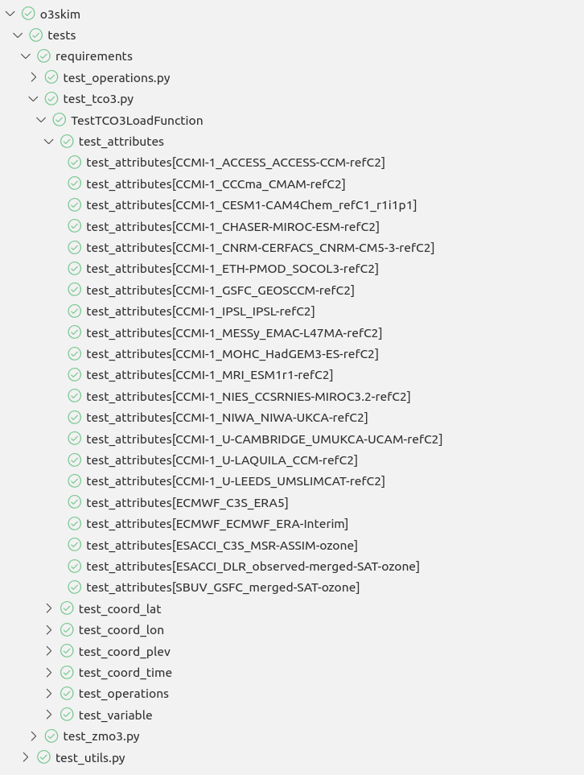

Extending o3skim models
=======================
When skimming ozone data, the most difficult challenge is to produce normalized
datasets from multiple sources. To do so, testing is the most fundamental
pillar to ensure all loaded datasets would have the same features, specially
when extending the list of supported sources and institutions.

To simplify extension of the library by scientist, this library has adopted
a "plugin" philosophy. Inside the library, you can find a set of subpackages
(folders in the folder o3skim) with multiple modules, each with the name of
the model it provides support for.

Scientist, maintainers and developers can extend o3skim by adding python
modules with a specific function to this folders. Feel free to copy and use
any of the already existing as examples for the extension process if you
do not know how to start.

First, extend testing for your model
------------------------------------
Test are always executed when calling `pytest`, `tox` or any `CICD` means.
In order to ensure your modules follow the normalization requirements,
you must add a small but still representative dataset for the model load function
you are about to create.

When the software is tested, a new parametrization for your load function
will be added to the following list of tests functions to validate your return dataset:

 - test_attributes: Provides the required CF Convention attributes.
 - test_coord_lat: Provides the correct latitude coordinates attributes.
 - test_coord_lon: Provides the correct longitude coordinates attributes.
 - test_coord_plev: Provides the correct air pressure coordinates attributes.
 - test_coord_time: Provides the correct time coordinates attributes.
 - test_operations: Provides compatibility with Xarray operations (i.e. mean).
 - test_variable: Provides the correct ozone variable attributes.

.. note::
    When adding test datasets, take into consideration the following:

     - Test samples are stored in a public repository, therefore should not contain private information, check attributes.
     - Time for testing and repository size are proportional to the test samples. Minimize datasets as much as possible.

Once the dataset is added, you can follow the details described at
:doc:`testing` to start the validation process.

Second, add your module and load function 
-----------------------------------------

Load functions for load_tco3
"""""""""""""""""""""""""""""""
You can add new modules to the subpackage **o3skim/loadfunctions_tco3**
in order to extend models available for the function `o3skim.load_tco3`.
This function should accept the paths expression to the dataset netCDF files
and return the final standardized Dataset.

.. code-block:: python

    def load_tco3(model_path):
        """Loads and returns a model and the dataset attributes.
        :param model_path: Paths expression to the dataset netCDF files
        :return: Standardized Dataset
        """
        ...
        return dataset

For testing, add the sample datasets to **tests/datasets_tco3**.

Load functions for load_zmo3
"""""""""""""""""""""""""""""""
You can add new modules to the subpackage **o3skim/loadfunctions_zmo3**
in order to extend models available for the function `o3skim.load_zmo3`.
This function should accept the paths expression to the dataset netCDF files
and return the final standardized Dataset.

.. code-block:: python

    def load_zmo3(model_path):
        """Loads and returns a model and the dataset attributes.
        :param model_path: Paths expression to the dataset netCDF files
        :return: Standardized Dataset
        """
        ...
        return dataset

For testing, add the sample datasets to **tests/datasets_zmo3**.

